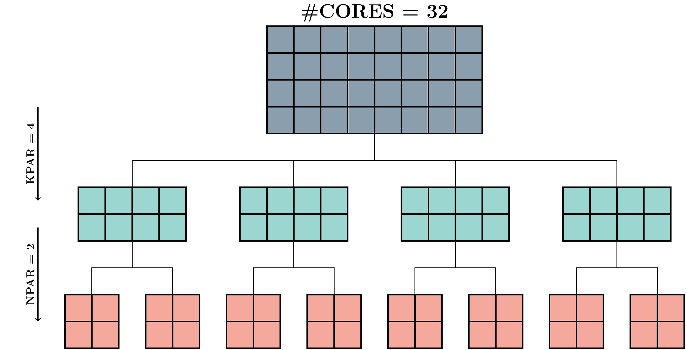

# Appendix

## Parallelization

As most DFT calculations require a substantial amount of computational resources, it is important to properly parallelize the workload over the various nodes/cores of a cluster, as failing to do so can severely affect the performance. For VASP, the parallelization can be controlled by several parameters:

- [`KPAR`](https://cms.mpi.univie.ac.at/wiki/index.php/KPAR): Determines the parallelization over the k-points. VASP treats `KPAR` k-points in parallel, i.e. it divides the available cores and k-points in `KPAR` groups and then assigns each group of cores to work on a group of k-points, one k-point at a time. As `KPAR` divides the k-points of the calculation in groups, `KPAR` is optimally chosen to be a divisor of the number of k-points. However, this rule should **not** be set in stone, as often choosing a higher `KPAR` that is not a divisor of the number of nodes leads to an improved optimization.

- [`NPAR`](https://cms.mpi.univie.ac.at/wiki/index.php/NPAR): A second way in which VASP allows parallelization is over the electronic bands. For each k-point, there are `#CORES`/`KPAR` cores working on it at a single time. Using `NPAR`, we can further divide the cores per k-point into `NPAR` groups, i.e. treat `NPAR` bands in parallel using `#CORES`/`KPAR`/`NPAR` cores. Note that similar to the `KPAR` and the number of `k-points`, `NPAR` should optimally be a divisor of the number of bands to avoid inactive cores. VASP actually enforces this by setting the number of bands (`NBANDS`) to the smallest multiple of `NPAR` higher than the requested (or default) bands.

- [`NCORE`](https://cms.mpi.univie.ac.at/wiki/index.php/NCORE): The number of cores that are working together on an individual band. For a specified `NPAR`, `NCORE` is automatically set using the following relation:  
$$\text{NCORE} = \frac{\text{#CORES / KPAR}}{\text{NPAR}}$$ 
In other words, the user should specify either `NPAR` or `NCORE`, as they are directly connected. As is said in the VASP manual, `NPAR` is preferred, i.e. if you do set both `NPAR` and `NCORE`, the `NCORE` value is ignored.

- [`NSIM`](https://cms.mpi.univie.ac.at/wiki/index.php/NSIM): This input tag defines the number of bands that are treated simultaneously in the blocked mode of the RMM-DIIS algorithm. This allows VASP to exploit matrix-matrix BLAS operations instead of matrix-vector operations, which could lead to a speed up on some machines. Peter Larsson [wrote an interesting article](https://www.nsc.liu.se/~pla/blog/2012/02/22/nparnsim/) on the topic. Overall, the gains are smaller compared to successfully utilizing `NPAR` and `KPAR`, but it might be worth experimenting with this value in case you rely on the RMM-DIIS algorithm.

As an example, consider the following parallelization settings for a calculation that uses 32 cores: `KPAR` = 4; `NPAR` = 2. The parallelization is shown schematically below. First, the total number of cores is divided among `KPAR` = 4 groups, resulting in `#CORES/KPAR` = 8 cores working on each group of kpoints. Next, the cores are split into `NPAR` = 2 groups, which means that`NCORE` = `#CORES`/`KPAR`/`NPAR` = 4 cores will be working simultaneously on each band.

Most applications for calculation time on a higher Tier system, such as the [BrEniac](https://www.vscentrum.be/tier1) cluster of the VSC, or the [PRACE](http://www.prace-ri.eu/) infrastructure of the European Union, require the user to demonstrate the scaling of their required calculations is optimal. This involves testing a range of parallelization settings for an increasing number of nodes, and comparing the speed of the calculation at higher node usage in order to analyse the efficiency.

### Setting up the workflows

Performing the same calculation with different parallelization settings is an ideal task for solving with a workflow. In [the `workflows_interface.ipynb` notebook](parallelization/workflow_interface.ipynb) we've set up a interface for performing these parallelization tests for a properly configured cluster.

**Note: Because the Binder server seems to have issues connecting to the mongoDB database, submitting workflows is not possible when using this notebook from Binder.**

### Analysing the parallelization test data

In [the `analysis.ipynb` notebook](parallelization/analysis.ipynb), we've developed an interface for analyzing the parallelization tests based on experimental plots. In the `data` dir, you can find some examples of processes data files from the workflows submitted from the [the `workflows_interface.ipynb` notebook](parallelization/workflow_interface.ipynb).

## CSHIFT

> [_Work in Progress_](../../figures/moss_fire.gif)